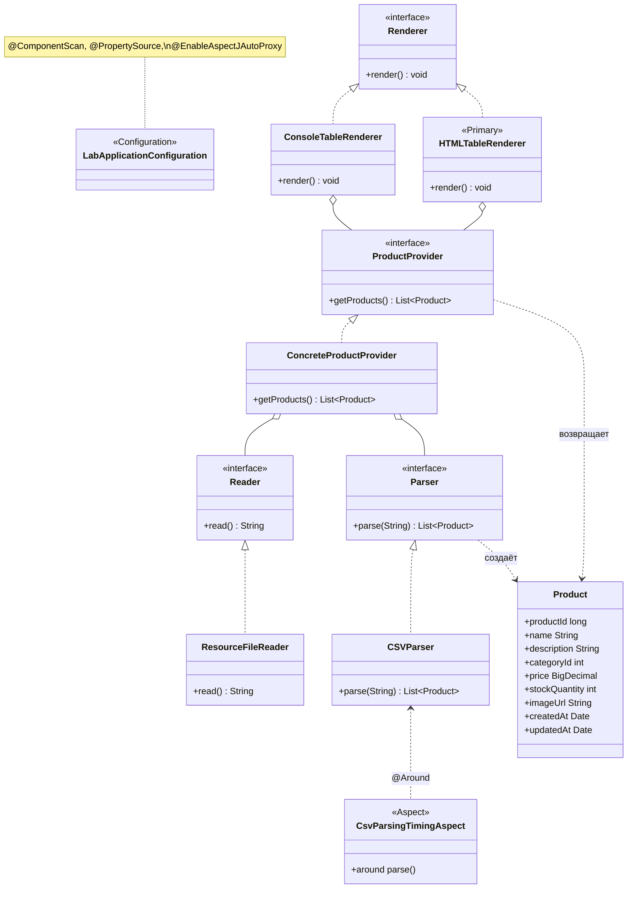

# Отчёт: лабораторная работа 4 (les04/lab)

## Цель

Перейти от явных `@Bean` в Java-конфигурации к **стереотипным аннотациям `@Component`**, вынести имя CSV в **`application.properties`** через **`@Value` и SpEL**, добавить **HTML-представление** таблицы, зафиксировать момент **инициализации** `ResourceFileReader` и замерить время **парсинга CSV** средствами **Spring AOP**.

## Выполнение

### Копирование базы

В каталог `les04/lab` перенесён результат **лабораторной № 1** (`les02/lab`): Gradle-проект `product-table` с модулем `app`, доменной моделью и чтением CSV.

### Конфигурация через `@Component`

Все компоненты приложения помечены **`@Component`** (реализации в пакете `ru.bsuedu.cad.lab.impl`):

- `ResourceFileReader`, `CSVParser`, `ConcreteProductProvider`, `ConsoleTableRenderer`, `HTMLTableRenderer`.

Точка сборки контекста — класс **`LabApplicationConfiguration`** с аннотациями:

- `@Configuration`
- `@ComponentScan("ru.bsuedu.cad.lab")` — сканирует также подпакеты `impl` и `aop`;
- `@PropertySource("classpath:application.properties")` — подключение свойств;
- `@EnableAspectJAutoProxy` — включение прокси для AOP.

Запуск: `AnnotationConfigApplicationContext(LabApplicationConfiguration.class)` в `App`.

### `application.properties`, `@Value` и SpEL

Файл **`app/src/main/resources/application.properties`**:

- `app.products.csv-file` — имя ресурса CSV на classpath;
- `app.products.html-output` — имя выходного HTML-файла (относительно рабочего каталога задачи `run`).

В **`ResourceFileReader`** и **`HTMLTableRenderer`** путь к файлам задаётся через SpEL с подстановкой свойства и **`trim()`**:

```text
@Value("#{'${app.products.csv-file}'.trim()}")
@Value("#{'${app.products.html-output}'.trim()}")
```

### HTML-рендер и выбор реализации

Добавлен **`HTMLTableRenderer`**: формирует валидный HTML с таблицей `<table>`, экранирует текст ячеек для безопасного вывода.

Чтобы при `getBean(Renderer.class)` использовалась именно эта реализация, на класс **`HTMLTableRenderer`** добавлена **`@Primary`** (альтернатива — `@Qualifier` у потребителя). **`ConsoleTableRenderer`** остаётся в контексте как дополнительный бин.

После записи файла в консоль выводится абсолютный путь к HTML.

### Жизненный цикл `ResourceFileReader`

После внедрения зависимостей вызывается **`@PostConstruct`**-метод: в консоль печатается отметка **`[Lifecycle]`** с датой и временем полной инициализации бина.

### AOP: время парсинга CSV

Подключены **`spring-aspects`** и **`aspectjweaver`**. Класс **`CsvParsingTimingAspect`** (`@Aspect`, `@Component`) оборачивает **`CSVParser.parse(..)`** советом **`@Around`**: в консоль выводится длительность в миллисекундах (`[AOP]`).

Поскольку **`CSVParser`** реализует интерфейс **`Parser`**, Spring создаёт **JDK-прокси** для бина `Parser`, и вызовы из **`ConcreteProductProvider`** проходят через аспект.

### Запуск

Из каталога **`les04/lab`**:

```bash
.\gradlew.bat run
```

Рабочий каталог задачи `run` задан как **корень лабораторной** (`les04/lab`), поэтому **`products.html`** создаётся рядом с `gradlew.bat` (имя задаётся в `application.properties`).

Сборка и тесты:

```bash
.\gradlew.bat build
```

## Обновлённая UML-диаграмма классов (mermaid)



## Выводы

Конфигурация упростилась за счёт **автосканирования компонентов**; параметры вынесены в **`application.properties`** с **SpEL** в **`@Value`**. **HTML**-вывод выделен в отдельный **`Renderer`** и выбран по умолчанию через **`@Primary`**. **Жизненный цикл** и **AOP** дают наблюдаемость: момент готовности читателя и длительность парсинга CSV видны в консоли при **`gradle run`**.
