# Отчёт: лабораторная работа 6 (les06/lab)

## Кратко: JDBC и Spring JDBC

**JDBC (Java Database Connectivity)** — стандартный API для работы с реляционными СУБД из Java: подключение к БД, выполнение SQL, обход результата `ResultSet`.

В **Spring** типичный стек для «ручного» SQL без JPA:

- **`DataSource`** — фабрика соединений с БД (в работе — встраиваемая H2 через **`EmbeddedDatabaseBuilder`**);
- **`JdbcTemplate`** — обёртка над JDBC, упрощает `UPDATE`/`INSERT`/`query`, меньше шаблонного кода;
- **`RowMapper`** — сопоставление одной строки `ResultSet` с объектом домена (в работе — `CategoryMultiProductRowMapper` → `CategoryProductSummary`).

**H2** в режиме embedded позволяет поднять БД в памяти процесса без отдельного сервера; скрипт `schema.sql` выполняется при инициализации `DataSource`.

**Logback** (`ch.qos.logback:logback-classic`) подключается как реализация **SLF4J** и используется для вывода результатов запроса на уровне **`INFO`** в консоль. Конфигурация — `app/src/main/resources/logback.xml`.

Сборка по-прежнему на **Gradle** (wrapper `gradlew` / `gradlew.bat`); обзор задач и установки — в [руководстве по установке Gradle](https://docs.gradle.org/current/userguide/installation.html) и [примере Java Application](https://docs.gradle.org/current/samples/sample_building_java_applications.html).

Подключённые артефакты (см. `gradle/libs.versions.toml`): **`org.springframework:spring-context:6.2.2`**, **`org.springframework:spring-jdbc:6.2.2`**, **`com.h2database:h2:2.3.232`**, **`ch.qos.logback:logback-classic:1.5.16`**.

## Цель работы

Продолжить приложение магазина зоотоваров на **Spring** с **Java-конфигурацией**: подключить встраиваемую **H2** через **`EmbeddedDatabaseBuilder`**, создать таблицы **`CATEGORIES`** и **`PRODUCTS`** с **внешним ключом**, загрузить данные из **CSV** в БД (**`DataBaseRenderer`**, **`JdbcTemplate`**), выполнить SQL-запрос категорий с **числом товаров больше 1** (**`CategoryRequest`**, **`RowMapper`**) и вывести результат в консоль через **Logback** (`INFO`). Запуск — **`gradle run`**.

## Выполнение

### Структура проекта

- Корень Gradle: `les06/lab` (имя сборки **product-table**, подпроект **`app`**); в корне добавлена задача **`run`**, делегирующая **`:app:run`**.
- Исходный код: `app/src/main/java/ru/bsuedu/cad/lab/`; реализации — пакет **`ru.bsuedu.cad.lab.impl`**.
- Данные: `app/src/main/resources/product.csv`, **`category.csv`**.
- Схема БД: **`app/src/main/resources/schema.sql`** (выполняется при старте встроенной БД).

База для кода — результат **лабораторной работы № 2** (`les02/lab`): те же роли `Reader` / `Parser` / `ProductProvider` / `Renderer` для товаров; добавлены сущность **категории**, второй CSV и слой JDBC.

### Диаграмма классов (реализация)

| Роль | Интерфейс | Реализация |
|------|-----------|------------|
| Чтение файла | `Reader` | `ResourceFileReader` — два бина: `productReader` / `categoryReader` (разделение через `@Qualifier`) |
| Разбор CSV товаров | `Parser` | `CSVParser` — строки в `List<Product>` |
| Разбор CSV категорий | `CategoryParser` | `CategoryCSVParser` — строки в `List<Category>` (общий разбор кавычек — `CSVParser.splitCsvLine`) |
| Список товаров | `ProductProvider` | `ConcreteProductProvider` |
| Список категорий | `CategoryProvider` | `ConcreteCategoryProvider` |
| Вывод (по умолчанию) | `Renderer` | **`DataBaseRenderer`** — вставка категорий и товаров в БД через `JdbcTemplate` |
| Вывод (альтернатива из лаб. 2) | `Renderer` | `ConsoleTableRenderer` — таблица в консоль (в конфигурации по заданию не используется как основной рендерер) |
| Сущность «товар» | `Product` | без изменений по смыслу лаб. 2 |
| Сущность «категория» | `Category` | `categoryId`, `name`, `description` |
| Запрос к БД | — | **`CategoryRequest`** + **`CategoryMultiProductRowMapper`** → **`CategoryProductSummary`** (record) |

### Диаграмма классов (UML, Mermaid)

```mermaid
classDiagram
    direction TB

    class App {
        +main(String[] args)
    }

    class LabConfiguration {
        +dataSource() DataSource
        +jdbcTemplate(DataSource) JdbcTemplate
        +productReader() Reader
        +categoryReader() Reader
        +parser() Parser
        +categoryParser() CategoryParser
        +productProvider(Reader, Parser) ProductProvider
        +categoryProvider(Reader, CategoryParser) CategoryProvider
        +renderer(...) Renderer
        +categoryRequest(JdbcTemplate) CategoryRequest
    }

    class Reader {
        <<interface>>
        +read() String
    }

    class Parser {
        <<interface>>
        +parse(String) List~Product~
    }

    class CategoryParser {
        <<interface>>
        +parse(String) List~Category~
    }

    class ProductProvider {
        <<interface>>
        +getProducts() List~Product~
    }

    class CategoryProvider {
        <<interface>>
        +getCategories() List~Category~
    }

    class Renderer {
        <<interface>>
        +render() void
    }

    class Product {
        -long productId
        -String name
        ...
    }

    class Category {
        -long categoryId
        -String name
        -String description
    }

    class CategoryProductSummary {
        <<record>>
        categoryId
        name
        description
        productCount
    }

    class CategoryRequest {
        -JdbcTemplate jdbcTemplate
        +execute() void
    }

    class ResourceFileReader {
        +read() String
    }

    class CSVParser {
        +parse(String) List~Product~
        +splitCsvLine(String)$ List~String~
    }

    class CategoryCSVParser {
        +parse(String) List~Category~
    }

    class ConcreteProductProvider {
        +getProducts() List~Product~
    }

    class ConcreteCategoryProvider {
        +getCategories() List~Category~
    }

    class ConsoleTableRenderer {
        +render() void
    }

    class DataBaseRenderer {
        -JdbcTemplate jdbcTemplate
        +render() void
    }

    class CategoryMultiProductRowMapper {
        <<Spring RowMapper>>
        +mapRow(ResultSet, int) CategoryProductSummary
    }

    App --> LabConfiguration : AnnotationConfigApplicationContext
    App ..> Renderer : getBean
    App ..> CategoryRequest : getBean

    LabConfiguration ..> Reader : @Bean
    LabConfiguration ..> Parser : @Bean
    LabConfiguration ..> CategoryParser : @Bean
    LabConfiguration ..> ProductProvider : @Bean
    LabConfiguration ..> CategoryProvider : @Bean
    LabConfiguration ..> Renderer : @Bean renderer
    LabConfiguration ..> CategoryRequest : @Bean

    ResourceFileReader ..|> Reader
    CSVParser ..|> Parser
    CategoryCSVParser ..|> CategoryParser

    ConcreteProductProvider ..|> ProductProvider
    ConcreteCategoryProvider ..|> CategoryProvider

    ConcreteProductProvider --> Reader
    ConcreteProductProvider --> Parser
    ConcreteCategoryProvider --> Reader
    ConcreteCategoryProvider --> CategoryParser

    ConsoleTableRenderer ..|> Renderer
    DataBaseRenderer ..|> Renderer

    ConsoleTableRenderer --> ProductProvider
    DataBaseRenderer --> JdbcTemplate
    DataBaseRenderer --> ProductProvider
    DataBaseRenderer --> CategoryProvider

    CategoryRequest --> JdbcTemplate
    CategoryRequest ..> CategoryMultiProductRowMapper
    CategoryMultiProductRowMapper ..> CategoryProductSummary : creates

    ProductProvider ..> Product : supplies
    CategoryProvider ..> Category : supplies
```



### База данных и SQL

Таблица **`CATEGORIES`** — справочник категорий; **`PRODUCTS`** — товары со ссылкой **`category_id`** на **`CATEGORIES`** (`FOREIGN KEY`). Порядок загрузки данных в приложении: сначала категории, затем товары (ограничение ссылочной целостности).

Запрос в **`CategoryRequest`**: соединение `categories` и `products`, агрегация **`COUNT`**, отбор **`HAVING COUNT(...) > 1`**.

### Spring (Java-конфигурация)

Класс **`LabConfiguration`** — `@Configuration`: бины **`DataSource`** (`EmbeddedDatabaseBuilder`, H2, `classpath:schema.sql`), **`JdbcTemplate`**, читатели CSV, парсеры, провайдеры, бин **`renderer`** → **`DataBaseRenderer`** (используется **по умолчанию**), **`CategoryRequest`**.

Точка входа **`App`**: контекст `AnnotationConfigApplicationContext(LabConfiguration.class)` → **`renderer.render()`** (загрузка CSV в БД) → **`categoryRequest.execute()`** (запрос и лог `INFO`).

### Запуск

Из каталога `les06/lab`:

```bash
.\gradlew.bat run
```

или (если в PATH есть Gradle 8.12+ и настроены `JAVA_HOME` / JDK 17):

```bash
gradle run
```

Сборка и тесты:

```bash
.\gradlew.bat build
```

Для корректного отображения **кириллицы** в стандартной консоли Windows может понадобиться UTF-8, например **`chcp 65001`** перед запуском или терминал вроде **Windows Terminal** с UTF-8.

### Ожидаемый вывод

После вставки данных в логе **`INFO`**: сообщение от **`DataBaseRenderer`** о числе загруженных категорий и товаров; затем результат **`CategoryRequest`** — категории с **более чем одним** товаром (для текущих CSV: **«Средства ухода»**, `category_id = 5`, два товара).

## Выводы

Освоены **`EmbeddedDatabaseBuilder`** и встраиваемая **H2**, описание схемы через **SQL** и **внешний ключ** между **`PRODUCTS`** и **`CATEGORIES`**. Для доступа к БД использованы **`DataSource`**, **`JdbcTemplate`** и **`RowMapper`**. Данные из CSV по-прежнему отделены от «представления»: новая роль **`DataBaseRenderer`** переносит их в таблицы; **`CategoryRequest`** демонстрирует выборку с группировкой и фильтром по **`HAVING`**, вывод через **Logback** на уровне **`INFO`**.
