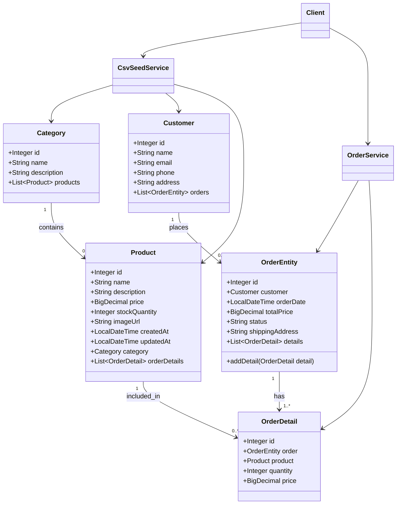

# Отчёт: лабораторная работа 8 (les08/lab)

## Кратко: JPA, Hibernate и Spring Data

**JPA** задаёт стандартный API для ORM в Java: описание сущностей и связей аннотациями, работа с объектной моделью вместо ручного SQL.

**Hibernate** выступает как JPA-провайдер: строит SQL, управляет `EntityManager`, состояниями сущностей и синхронизацией с БД.

**Spring Data JPA** сокращает слой доступа к данным за счёт готовых репозиториев (`JpaRepository`) и инфраструктуры транзакций в связке со Spring ORM.

В этой работе собран проект магазина зоотоваров со слоистой архитектурой (`entity` / `repository` / `service` / `app`), H2 + HikariCP, автогенерацией схемы из JPA-сущностей и транзакционным созданием заказа.

## Цель

Перейти от JDBC-реализации к ORM-подходу на базе **Hibernate + Spring Data JPA**, описать модель предметной области через JPA-сущности и связи, реализовать репозитории/сервисы, выполнить транзакционное создание заказа и подтвердить сохранение данных в БД.

## Выполнение

### Структура проекта

В каталоге `les08/lab` создан отдельный Gradle-проект с подпроектом `app`.

Пакеты приложения:

- `ru.bsuedu.cad.lab.entity` — JPA-сущности;
- `ru.bsuedu.cad.lab.repository` — репозитории Spring Data;
- `ru.bsuedu.cad.lab.service` — бизнес-сервисы;
- `ru.bsuedu.cad.lab.app` — клиент запуска сценария;
- `ru.bsuedu.cad.lab` — конфигурация Spring и точка входа `App`.

### Конфигурация БД и JPA

- Используется **H2** (`jdbc:h2:./app/data/labdb`).
- Источник данных — **`HikariDataSource`** (`ConfigBasic`).
- JPA-конфигурация — `ConfigJpa`:
  - `@EnableJpaRepositories`
  - `@EnableTransactionManagement`
  - `LocalContainerEntityManagerFactoryBean`
  - Hibernate-свойство `hibernate.hbm2ddl.auto=create-drop` (схема создаётся автоматически по сущностям).

### Сущности и связи

Реализованы сущности:

- `Category`
- `Product`
- `Customer`
- `OrderEntity`
- `OrderDetail`

Связи:

- `Category` 1:M `Product`
- `Customer` 1:M `OrderEntity`
- `OrderEntity` 1:M `OrderDetail`
- `Product` 1:M `OrderDetail`

### Репозитории

Для каждой сущности создан репозиторий на базе `JpaRepository`:

- `CategoryRepository`
- `ProductRepository`
- `CustomerRepository`
- `OrderRepository`
- `OrderDetailRepository`

В каждом добавлены методы, требуемые формулировкой лабораторной:

- `create(...)`
- `getRecordById(...)`
- `getAll()`

### Сервисный слой

- `CsvSeedService` загружает стартовые данные в `categories`, `customers`, `products` из CSV-файлов (`category.csv`, `customer.csv`, `product.csv`) из ресурсов.
- `OrderService` реализует:
  - транзакционное создание заказа `createOrder(...)` (`@Transactional`);
  - расчёт общей суммы заказа;
  - проверку наличия клиента/товара и остатков;
  - обновление `stock_quantity`;
  - получение списка заказов `getAllOrders()`.

### Клиентский сценарий (`app.Client`)

При запуске:

1. Загружаются данные из CSV;
2. Создаётся новый заказ в транзакции;
3. В лог выводятся данные созданного заказа (`id`, `customerId`, `total`, `status`);
4. Запрашивается список всех заказов и логируется результат.

Таким образом подтверждается, что созданный заказ сохранён в БД и доступен при повторном чтении.

## Обновлённая UML-диаграмма классов (mermaid)



## Запуск

Из директории `les08/lab`:

```bash
gradle run
```

Ожидаемый результат: в консоли отображается загрузка начальных данных, создание заказа в транзакции и перечень заказов, содержащий новый заказ.

## Выводы

В лабораторной реализован переход к ORM-подходу: предметная область описана JPA-сущностями и связями, работа с БД вынесена в Spring Data-репозитории, бизнес-логика — в сервисный слой. Настройка H2 + HikariCP и автогенерация схемы позволяют запускать приложение без ручного создания таблиц. Транзакционное создание заказа и последующее чтение списка заказов подтверждают корректную запись данных в БД.
