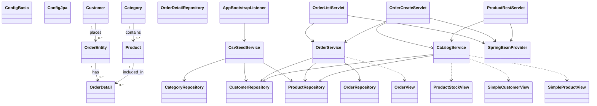

# Отчёт: лабораторная работа 10 (les10/lab)

## Кратко: Web-приложение на Servlet + Spring

В этой работе приложение из `les08/lab` перенесено в web-формат с упаковкой в **WAR** для деплоя в **Apache Tomcat 11**.  
Серверная логика реализована через **Servlet API (Jakarta)**, бизнес-слой и доступ к данным остаются на **Spring + JPA + Spring Data**.

Собраны три веб-точки:

- HTML-страница списка заказов (`/orders`);
- HTML-форма создания заказа (`/orders/new`);
- REST endpoint по товарам (`/api/products`) в JSON.

## Цель

Развернуть web-интерфейс для магазина зоотоваров: настроить сборку WAR, реализовать servlet-страницы для просмотра/создания заказов, добавить REST-сервис продуктов и подготовить проект к деплою на Apache Tomcat 11.

## Выполнение

### Структура проекта

Создан проект `les10/lab` (Gradle multi-project: `lab` + `app`), где:

- `ru.bsuedu.cad.lab.entity` — JPA-сущности предметной области;
- `ru.bsuedu.cad.lab.repository` — Spring Data репозитории;
- `ru.bsuedu.cad.lab.service` — бизнес-сервисы;
- `ru.bsuedu.cad.lab.web` — servlet-слой;
- `src/main/webapp/WEB-INF/web.xml` — конфигурация web-приложения;
- `src/main/resources/data/*.csv` — исходные данные для загрузки.

### WAR и зависимости

В `app/build.gradle.kts` подключены плагины `java` и `war`.

Ключевые зависимости:

- `jakarta.servlet-api` (compileOnly) — Servlet API;
- `spring-web` — `ContextLoaderListener` и доступ к Spring context в web-среде;
- `spring-data-jpa`, `spring-orm`, `hibernate`, `hikari`, `h2`;
- `jackson-databind` — сериализация JSON для REST.

Итог сборки: `app/build/libs/app.war`.

### Конфигурация web-контекста

В `web.xml` настроены:

- `AnnotationConfigWebApplicationContext`;
- `contextConfigLocation = ru.bsuedu.cad.lab.ConfigJpa`;
- `ContextLoaderListener` для старта Spring `ApplicationContext`;
- `AppBootstrapListener` для первичной загрузки CSV в БД при запуске;
- `welcome-file = orders`.

### Реализованные сервлеты

#### 1) Страница заказов

`OrderListServlet` (`/orders`):

- получает список заказов из `OrderService`;
- формирует HTML-таблицу;
- содержит кнопку перехода на форму создания заказа.

#### 2) Форма создания заказа

`OrderCreateServlet` (`/orders/new`):

- `GET` — выводит HTML-форму (клиент, адрес, товар, количество);
- `POST` — создаёт заказ через `OrderService.createOrder(...)`;
- после успешного создания выполняет redirect на `/orders`.

#### 3) REST сервис продуктов

`ProductRestServlet` (`/api/products`):

- возвращает JSON-массив;
- для каждого продукта выводит:
  - название продукта,
  - название категории,
  - количество на складе.

Формат формируется через `ObjectMapper` (Jackson).

### Сервисы и транзакции

- `CsvSeedService` загружает `category.csv`, `customer.csv`, `product.csv` в H2.
- `OrderService` выполняет создание заказа в `@Transactional`, считает сумму и уменьшает остатки.
- `CatalogService` отдаёт данные для формы и REST endpoint.

### Репозитории

Для каждой сущности созданы репозитории с методами:

- `create(...)`
- `getRecordById(...)`
- `getAll()`

## UML-диаграмма классов (mermaid)



## Сборка и деплой

Из каталога `les10/lab`:

```bash
gradle war
```

Далее:

1. Развернуть `app.war` в Apache Tomcat 11 (например, через `webapps` или `manager`).
2. Проверить страницы:
   - `http://localhost:8080/app/orders`
   - `http://localhost:8080/app/orders/new`
3. Проверить REST в Postman:
   - `GET http://localhost:8080/app/api/products`

## Выводы

Приложение успешно переведено в web-формат: настроена сборка WAR, организован запуск Spring-контекста в servlet-среде через `ContextLoaderListener`, реализованы HTML и REST интерфейсы для заказов и товаров. Структура слоёв из предыдущей лабораторной сохранена, что позволило добавить web-уровень без переработки бизнес-логики и JPA-слоя.
