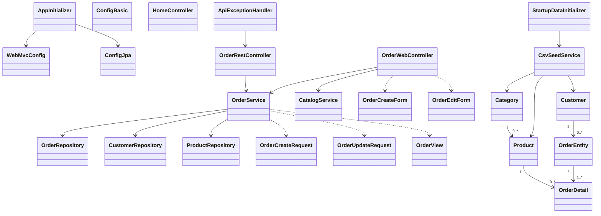

# Отчёт: лабораторная работа 12 (les12/lab)

## Что делали

В этой лабе перешли от обычных сервлетов к **Spring MVC**:

- сделали REST API для заказов (полный CRUD),
- подключили **Thymeleaf**,
- сделали web-интерфейс для заказов (список, создание, изменение, удаление),
- подготовили проект к сборке в `WAR` и деплою в Tomcat 11.

## Цель

Собрать web-приложение на Spring MVC поверх предыдущей лабы:

1. REST API для заказов (`@RestController`);
2. web-интерфейс через Thymeleaf (`@Controller`);
3. сборка `war` и проверка через Tomcat + Postman.

## Выполнение

### 1) Основа проекта

В `les12/lab` скопирована и адаптирована структура из прошлой лабы:

- `entity` — JPA-сущности,
- `repository` — Spring Data репозитории,
- `service` — бизнес-логика,
- `controller` — MVC и REST контроллеры.

БД: H2 + Hikari + Hibernate/JPA.  
Данные заполняются из CSV при старте (`StartupDataInitializer` + `CsvSeedService`).

### 2) Настройка Spring MVC

Добавлены:

- `AppInitializer` (`AbstractAnnotationConfigDispatcherServletInitializer`) — запускает Spring в контейнере;
- `WebMvcConfig` (`@EnableWebMvc`) — MVC конфигурация;
- Thymeleaf ViewResolver (`/WEB-INF/templates/*.html`).

### 3) REST API заказов

Сделан `OrderRestController` (`/api/orders`):

- `GET /api/orders` — список заказов;
- `GET /api/orders/{id}` — заказ по id;
- `POST /api/orders` — создать заказ;
- `PUT /api/orders/{id}` — изменить адрес/статус;
- `DELETE /api/orders/{id}` — удалить заказ.

Для ошибок добавлен `ApiExceptionHandler`, чтобы в ответе был понятный JSON с ошибкой.

### 4) Thymeleaf интерфейс заказов

Сделан `OrderWebController`:

- `GET /orders` — страница списка заказов (`orders-list.html`);
- `GET /orders/new` + `POST /orders/new` — создание заказа (`orders-create.html`);
- `GET /orders/{id}/edit` + `POST /orders/{id}/edit` — изменение (`orders-edit.html`);
- `POST /orders/{id}/delete` — удаление.

Также есть `HomeController`, который кидает с `/` на `/orders`.

### 5) Коллекция Postman

Добавил коллекцию:

- `postman/orders-api.postman_collection.json`

Там есть готовые запросы для проверки CRUD.

## UML (mermaid)



## Как запускать и проверять

Из папки `les12/lab`:

```bash
gradle war
```

Дальше деплой `app.war` в Tomcat 11.

Проверка:

- Web:
  - `http://localhost:8080/app/orders`
- REST:
  - `http://localhost:8080/app/api/orders`

В Postman можно просто импортировать `postman/orders-api.postman_collection.json`.

## Итог

Получилось полноценное Spring MVC приложение:

- REST API с CRUD для заказов,
- отдельный web-интерфейс на Thymeleaf,
- всё упаковывается в WAR и готово для Tomcat 11.

ТЗ для лабы: [les12/lab.md](https://raw.githubusercontent.com/chebotarevsa/cad-2025/main/les12/lab.md)
