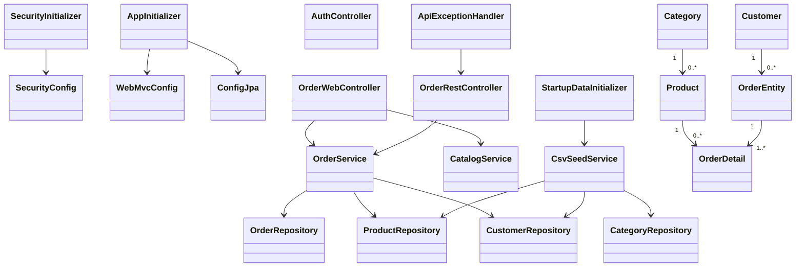

# Отчёт: лабораторная работа 14 (les14/lab)

## Что сделано

На основе `les12/lab` добавлена безопасность через **Spring Security**:

- два пользователя: `user/user` и `manager/manager`;
- ролевой доступ:
  - `user` — только просмотр заказов,
  - `manager` — все операции с заказами;
- form login для web-интерфейса;
- Basic Auth для REST API.

## Как настроено

### 1) Зависимости

В `app/build.gradle.kts` подключены:

- `spring-security-config`
- `spring-security-web`

Плюс остальной стек из прошлой лабы: Spring MVC, JPA, Thymeleaf, H2 и т.д.

### 2) Security конфигурация

Главный класс: `SecurityConfig`.

Сделаны **2 SecurityFilterChain**:

1. **API chain** (`/api/**`, `@Order(1)`)
   - вход только через **HTTP Basic**;
   - `GET /api/orders/**` → `ROLE_USER` и `ROLE_MANAGER`;
   - `POST/PUT/DELETE /api/orders/**` → только `ROLE_MANAGER`.

2. **Web chain** (`@Order(2)`)
   - вход через **form login** (`/login`);
   - `GET /orders` → `ROLE_USER` и `ROLE_MANAGER`;
   - всё, что меняет заказы (`/orders/new`, `/orders/{id}/edit`, `/orders/{id}/delete`) → только `ROLE_MANAGER`.

Пользователи заданы в `InMemoryUserDetailsManager`.

### 3) Web интерфейс

Оставлен интерфейс из MVC-лабы:

- `/orders` — список;
- `/orders/new` — создание;
- `/orders/{id}/edit` — изменение;
- `/orders/{id}/delete` — удаление.

Добавлена страница входа: `login.html`.

### 4) REST API

Оставлен CRUD из прошлой лабы:

- `GET /api/orders`
- `GET /api/orders/{id}`
- `POST /api/orders`
- `PUT /api/orders/{id}`
- `DELETE /api/orders/{id}`

Доступ теперь защищён Basic Auth.

## UML (mermaid)



## Проверка

Сборка:

```bash
gradle war
```

После деплоя в Tomcat 11:

- UI:
  - `http://localhost:8080/app/login`
  - `http://localhost:8080/app/orders`
- REST:
  - `GET http://localhost:8080/app/api/orders` (Basic Auth)

## Вывод

В проект добавлен ролевой доступ для web и REST частей:

- через форму логина защищён web-интерфейс;
- через Basic Auth защищён REST;
- права разграничены по ролям `user` и `manager` согласно заданию.

Основа задания: [les14/lab.md](https://raw.githubusercontent.com/chebotarevsa/cad-2025/main/les14/lab.md)
