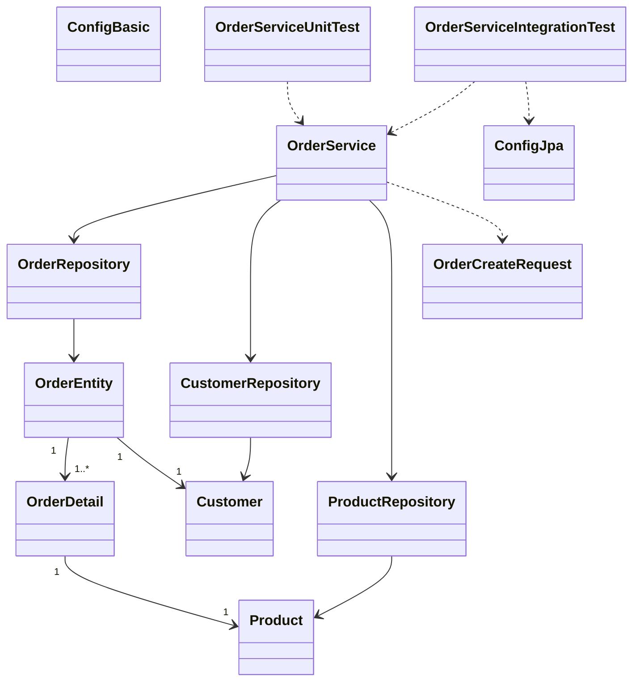

# Отчёт: лабораторная работа 16 (les16/lab)

## Что сделано

В этой лабе сделал акцент именно на тестах для сервиса создания заказа:

- подключил Unit-тесты;
- подключил интеграционные тесты;
- настроил JaCoCo;
- добавил позитивные и негативные сценарии.

## Настройка проекта под тестирование

В `app/build.gradle.kts` добавлены:

- `JUnit 5`;
- `Mockito` (для unit тестов);
- `spring-test` (для интеграционных тестов со Spring Context);
- `jacoco`.

Отчёт JaCoCo генерируется задачей:

```bash
gradle test jacocoTestReport
```

HTML отчёт будет в:

- `app/build/reports/jacoco/test/html/index.html`

## Unit-тесты

Файл: `app/src/test/java/ru/bsuedu/cad/lab/service/OrderServiceUnitTest.java`

Проверил два сценария:

1. **Успешное создание заказа**
   - корректно считается сумма заказа;
   - создаётся деталь заказа;
   - вызывается сохранение заказа и обновление товара.

2. **Неуспешное создание**
   - если товара на складе меньше, чем нужно — выбрасывается `IllegalArgumentException`.

В unit-тестах репозитории замоканы, чтобы проверить логику самого сервиса изолированно.

## Интеграционные тесты

Файл: `app/src/test/java/ru/bsuedu/cad/lab/service/OrderServiceIntegrationTest.java`

Проверил взаимодействие сервиса с реальными репозиториями и H2:

1. **Успешный сценарий**
   - заказ реально сохраняется в БД;
   - сумма заказа корректная;
   - остаток товара уменьшается.

2. **Неуспешный сценарий**
   - при недостатке товара кидается исключение;
   - заказ в БД не создаётся.

Для тестов используется отдельный in-memory datasource:

- `app/src/test/resources/db/jdbc.properties`

## UML (mermaid)



## Как запускать

Из папки `les16/lab`:

```bash
gradle test
gradle jacocoTestReport
```

## Итог

Сервис создания заказа покрыт и unit, и integration тестами.  
Есть проверка и успешных, и неуспешных сценариев.  
JaCoCo настроен, отчёт покрытия генерируется.

Основа задания: [les16/lab.md](https://raw.githubusercontent.com/chebotarevsa/cad-2025/main/les16/lab.md)
